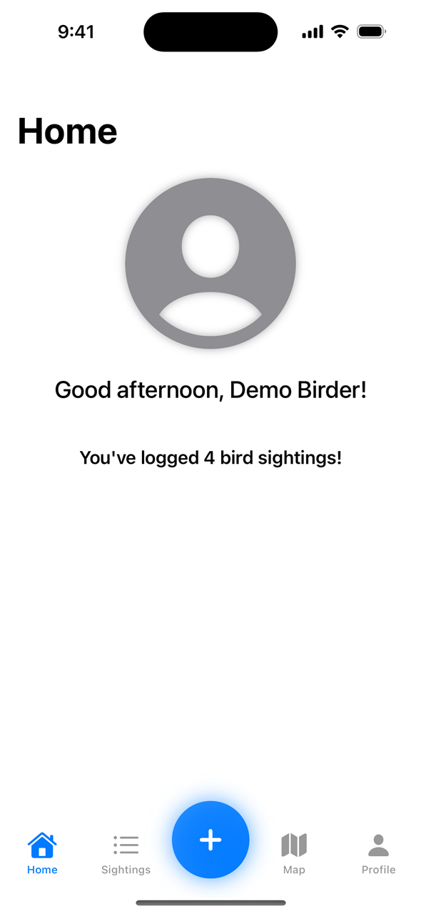
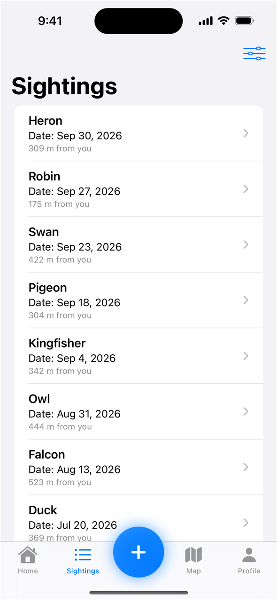
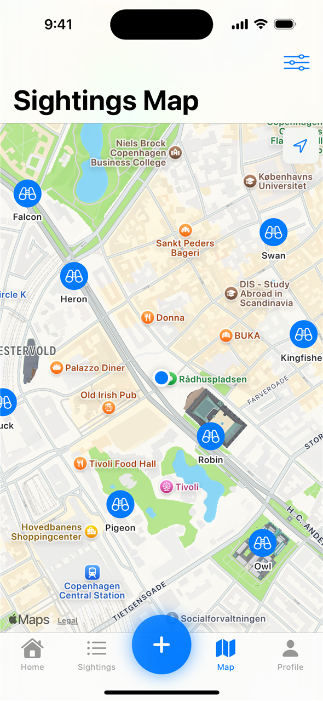

# Birdie

[](https://github.com/CMaintz/birdie-ios/actions/workflows/ci.yml)

A birdwatching iOS app built with SwiftUI and Firebase. Log bird sightings at your current location, browse them in a list or on a map, and filter by species, distance, or your own entries.

Built as my iOS exam project on the Datamatiker (Computer Science AP) programme in May 2025, and tidied up afterwards (dependency injection, error handling, unit tests, CI).

<p align="center">
  
  
  
</p>

<sub>Screenshots are captured automatically in CI by running the app in demo mode on an iOS simulator (see [Demo mode](#demo-mode)).</sub>

## Features

- **Authentication**: register and log in with email and password (Firebase Auth)
- **Log sightings**: pick a species, add an optional note, and the sighting is tagged with your GPS location
- **Sightings list**: all sightings, newest first, with swipe-to-delete on your own entries and pull to refresh
- **Map view**: sightings plotted on a MapKit map; tap a pin for details
- **Filters**: up to 10 species, maximum distance from you, or only your own sightings
- **Profile**: change display name, email (Firebase sends a verification mail first) and password

Supported species: Robin, Sparrow, Eagle, Bald Eagle, Hawk, Owl, Blackbird, Finch, Woodpecker, Duck, Swan, Pigeon, Parrot, Falcon, Pelican, Kingfisher, Heron, Toucan.

## Tech stack

- SwiftUI with the Observation framework (`@Observable`) and Swift Concurrency
- Firebase Auth and Cloud Firestore (Swift Package Manager)
- MapKit and Core Location
- [AlertToast](https://github.com/elai950/AlertToast) for toasts
- Swift Testing for unit tests, GitHub Actions for CI
- Debug-only data seeding uses [randomuser.me](https://randomuser.me), [DiceBear](https://www.dicebear.com) avatars and, optionally, the [OpenCage](https://opencagedata.com) geocoder

## Architecture

```
Views (SwiftUI)
  │  read state from, and call, @Observable controllers injected via .environment(...)
  ▼
Controllers              AuthController · UserController · BirdSpotController · LocationController
  │  depend only on protocols
  ▼
Contracts                AuthServiceProtocol · SpotRepositoryProtocol
  ▲
  │  implemented by
Services                 Firebase/   FirebaseAuthService, FirestoreSpotRepository
                         InMemory/   InMemoryAuthService, InMemorySpotRepository, DemoData
```

- `App/AppServices.swift` is the composition root. `AppMode.resolve()` picks the Firebase services for normal runs and the in-memory ones for `--demo`, unit tests and SwiftUI previews.
- Business rules live outside the views so they can be unit tested: `SpotFilterData.apply` (species / "only mine" / distance filtering and newest-first ordering), `FormValidation` and `ProfileChanges` (form validation), plus the controllers themselves.
- Errors are logged with `os.Logger` and shown to the user as alerts or toasts instead of being printed.

```
Birdie/
├── App/            Composition root and launch modes
├── Contracts/      Service protocols
├── Controllers/    @Observable state + logic used by the views
├── Models/         BirdSpot, BirdSpecies, Location, filters, validation
├── Services/
│   ├── Firebase/   Firebase Auth + Firestore implementations
│   ├── InMemory/   In-memory implementations and demo data
│   └── Seeders/    DEBUG-only sample data generators
├── Support/        Logging, preview helpers, view extensions
└── Views/          SwiftUI screens
BirdieTests/        Unit tests (Swift Testing)
```

## Requirements

- Xcode 16.3 or newer (the code uses Swift 6.1 syntax; the project stays in Swift 5 language mode)
- iOS 18.4+
- For real data: a Firebase project with Email/Password auth and Cloud Firestore enabled

## Setup

1. **Clone the repo**
   ```bash
   git clone https://github.com/CMaintz/birdie-ios.git
   cd birdie-ios
   ```

2. **Add your Firebase config**
   ```bash
   cp Birdie/GoogleService-Info.plist.example Birdie/GoogleService-Info.plist
   ```
   Replace the placeholder values with the ones from your app in the [Firebase console](https://console.firebase.google.com), or download the file from there directly. Sightings are stored in a `birdSpots` collection. Combining the species or "only mine" filters with date ordering needs composite indexes; Firestore logs a link that creates them the first time such a query runs.

3. **(Optional) Add an OpenCage API key**
   ```bash
   cp Birdie/Secrets.plist.example Birdie/Secrets.plist
   ```
   Only the debug-only global seeder (`SpotSeederService.createGlobalBirdSpots`) uses it, to check whether random coordinates are on land. The app itself runs without it.

4. **Open and run**
   ```bash
   open Birdie.xcodeproj
   ```
   Xcode resolves the Swift packages on first open. Build and run the `Birdie` scheme on a simulator or device.

`GoogleService-Info.plist` and `Secrets.plist` are in `.gitignore`; only the `.example` templates are committed.

### Demo mode

Launch with the `--demo` argument to run without Firebase: you are signed in as a demo user at a fixed location in Copenhagen with a handful of sample sightings, all kept in memory. In Xcode, enable the `--demo` argument under *Product › Scheme › Edit Scheme › Run › Arguments* (it is already there, just unchecked). `--tab home|list|map|profile` opens a specific tab and `--skip-splash` skips the intro animation; the screenshot workflow uses both.

### Seeding a Firebase project (debug builds only)

Debug builds can fill an empty Firebase project with sample data: ten users from randomuser.me, each with 5-15 random sightings around Denmark. This creates real Firebase Auth accounts, so it only runs when you ask for it: enable the `--seed-firebase` launch argument in the scheme (or set `BIRDIE_SEED=1`). It runs once per install; release builds don't include the seeder.

## Tests

The `BirdieTests` target uses Swift Testing and runs against the in-memory services, so it needs no Firebase config or network. It covers:

- `BirdSpotController`: loading, filtering and sorting, add validation, delete ownership checks, and error handling, using a mock repository
- `SpotFilterData.apply`: species, "only mine" and distance filters, alone and combined
- `Location`: distance, `isWithin` and distance formatting
- `FormValidation` and `ProfileChanges`: login, registration and profile form rules
- `AuthController` and `UserController`: sign-in/up/out and profile updates
- Launch mode selection, demo data and the in-memory repository

Run them with ⌘U in Xcode or from the command line:

```bash
xcodebuild test -project Birdie.xcodeproj -scheme Birdie \
  -destination 'platform=iOS Simulator,name=iPhone 16'
```

CI ([`.github/workflows/ci.yml`](.github/workflows/ci.yml)) builds the app and runs the tests on a macOS runner (Xcode 16.4, iOS 18 simulator) for every push to `main` and every pull request, and adds the coverage report to the job summary. The Firebase-backed services (`FirebaseAuthService`, `FirestoreSpotRepository`) and the SwiftUI views are not unit tested; that would need the Firebase Emulator Suite and UI tests.

## Known limitations

- No Firestore security rules are included in the repo; configure them in your Firebase project.
- Distance filtering happens on the device after fetching, so every matching sighting is downloaded; fine for a demo, not for a large dataset.
- Profile data (name, photo) lives on the Firebase Auth user rather than in Firestore.

## License

[MIT](LICENSE)
